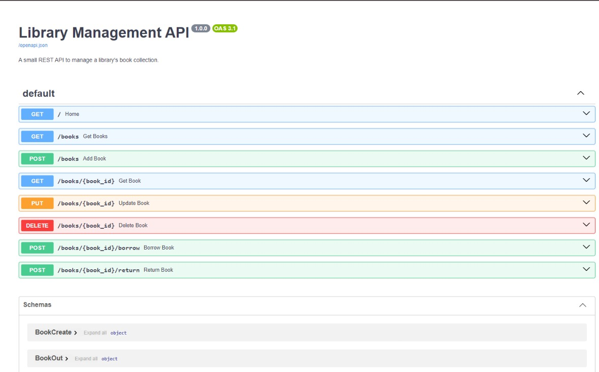

# Library Management API

A REST API for managing a small library's book collection, built with
FastAPI and SQLite. It supports full CRUD on books plus borrow/return
actions with availability checks.

## Tech
- FastAPI
- SQLite
- SQLAlchemy
- Pydantic

## How to run

    python -m venv venv
    venv\Scripts\activate      # or: source venv/bin/activate on Mac
    pip install -r requirements.txt
    python seed.py
    uvicorn main:app --reload

Open http://127.0.0.1:8000/docs
🔗 **Live Demo:** https://library-api-qkjj.onrender.com/docs 
*(Note: Hosted on Render's free tier. It may take 50 seconds to wake up on the first click!)*

## Endpoints

| Method | Endpoint | Description |
|--------|----------|-------------|
| GET | /books | List all books |
| GET | /books/{id} | Get one book |
| POST | /books | Add a book |
| PUT | /books/{id} | Update a book |
| DELETE | /books/{id} | Delete a book |
| POST | /books/{id}/borrow | Borrow a book |
| POST | /books/{id}/return | Return a book |